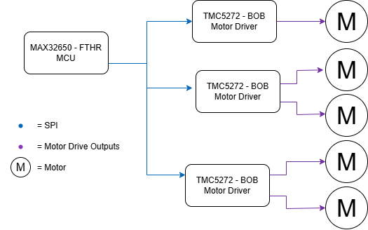

# TMC5272 Motor Control Driver

This TMC5272 driver provides a C API for ADI's Trinamic TMC5272, enabling: 

- IC initialization and application-specific configuration
- Motor movement via position & velocity control
- Trinamic Tricoder position feedback
- StallGuard2 configuration & sensorless stall detection

The driver establishes communications via the SPI bus. UART is currently **not** supported.

## Driver Demo

A demo of repository functionality is provided in `main.c`, and is configured to use a MAX32650FTHR microcontroller.

This API is compatible with most microcontrollers; however, the functions `tmc5272_SPI_readWrite` and `tmc5272_SPI_init` must be ported.

### Hardware / Software Requirements

The demo uses the following hardware:

- [MAX32650FTHR](https://www.analog.com/en/resources/evaluation-hardware-and-software/evaluation-boards-kits/max32650fthr.html)
- TMC5272 Evaluation Platform
    - [TMC5272-BOB](https://www.analog.com/en/resources/evaluation-hardware-and-software/evaluation-boards-kits/tmc5272-bob.html)
    - [TMC5272-EVAL](https://www.analog.com/en/resources/evaluation-hardware-and-software/evaluation-boards-kits/tmc5272-eval.html)
- Stepper motor(s)

The repository does not rely on Maxim SDK; however, the configured demo uses a MAX32650. To run the demo using the above hardware, install the [Maxim SDK](https://github.com/analogdevicesinc/msdk). Please refer to the MSDK documentation for instructions on building, flashing, and running projects.

### Hardware Setup

- Connect a TMC5272-BOB to the MAX32650 FTHR board via SPI1. (Use SS1, SS2, or SS3.) 
- Wire stepper motors to the TMC5272 A/B & C/D outputs.
    - Ensure that each ± A/B and ± C/D output pair is maintained.
    - Ensure that all motors match wiring polarity to ensure the same rotational direction.
- Connect TMC GND <-> MAX32650 GND.
- Provide 12V to the TMC5272 on VM. 
- Provide 3.3V to the TMC5272 on VDD. (This can be supplied via MAX32650FTHR.)

| Pin | Header Name | Connection |   | Pin | Header Name | Connection       |
|-----|-------------|------------|---|-----|-------------|------------------|
| 1   | VCC_IO      | 3.3V       |   | 15  | +VM         | 12V              |
| 2   | GND         | 0V         |   | 16  | GND         | 0V               |
| 3   | ENCA1       | -          |   | 17  | OD1         | M1.D1            |
| 4   | ENCB1/REFL1 | -          |   | 18  | OD2         | M1.D2            |
| 5   | ENCN1/REFR1 | -          |   | 19  | OC1         | M1.C1            |
| 6   | SPI_CSn     | SPI_CS     |   | 20  | OC2         | M1.C2            |
| 7   | SPI_SCK     | SPI_SCK    |   | 21  | GND         | 0V               |
| 8   | SPI_MOSI    | SPI_MOSI   |   | 22  | OA1         | M0.A1            |
| 9   | SPI_MISO    | SPI_MISO   |   | 23  | OA2         | M0.A2            |
| 10  | CLK         | 0V         |   | 24  | OB1         | M0.B1            |
| 11  | SLEEPn      | -          |   | 25  | OB2         | M0.B2            |
| 12  | ENCA2       | -          |   | 26  | GND         | 0V               |
| 13  | ENCB2/REFL2 | -          |   | 27  | DIAG0       | GPIO (Interrupt) |
| 14  | ENCN2/REFR2 | -          |   | 28  | DIAG1       | GPIO (Interrupt) |

> [!caution]
> Do not connect / disconnect a motor while power is enabled! This can cause current to flow into the TMC5272 drivers, potentially damaging the device.
>
> Additionally, turn on the 12V before providing 3.3V, and remove 3.3V before removing 12V. Otherwise, the board may draw power from the 3.3V rail. (I haven't had this break anything yet, but it certainly seems bad.)

### Software Setup

This project uses a .gitignore in order to only track application-specific files. Copy the repo's contents into a blank project from the MaximSDK `Examples` folder. 

Refer to [MSDK User Guide](https://analogdevicesinc.github.io/msdk//USERGUIDE/#getting-started-with-visual-studio-code) for documentation on building and flashing an application to the MAX32650FTHR.

#### 3. Example Usage

The provided `main.c` demonstrates:

- Necessary setup steps:
    - Initializing SPI and TMC5272 devices using `tmc5272_dev_t`
    - Configuring motion profiles (velocity curves)
- Moving motors to absolute/relative positions
- Polling for arrival
- Basic Tricoder polling

See `TMC5272.h` for the full API.

### Application Notes

- Default register values are preset in `tmc5272_init()`. These can be left as-is, and should be good for most (NEMA17) stepper motors. (Use the Trinamic TMCL-IDE to explore alternative configurations.)

- Many API functions accept `ALL_MOTORS` to apply actions to both axes. Any functions that do not support this are noted in their function comments. Mostly these are `get()` functions for which it would not make sense to return a single value.

- Look at the `#define` statements in `main.c` and `TMC5272_SPI.h`; modify as needed.

### Acknowledgements & Licensing
This project is licensed under the MIT license, as detailed in this repo's LICENSE.txt.

This project uses and extends the [TMC-API](https://github.com/analogdevicesinc/TMC-API) provided by Analog Devices' Trinamic, which is licensed under the MIT license.